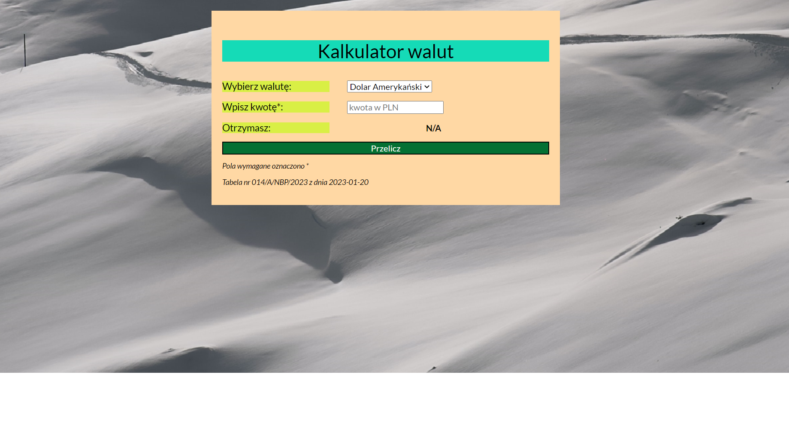

# Mateusz Kornacki - Currency calculator

## Demo

https://mat842.github.io/Currency-calculator/

## Description

With this page we can calculate the exchange rates of the main currencies.
Below is a manual for the calculator in the form of a gif.

[Instruction](images/instruction.gif)

## To create this website I use the following technologies:

- HTML - markup language,
- CSS - style sheet language,
- JAVA SCRIPT - programing language,
- I used BEM convention,
- ES 6+ features,
- I used to a normalizer version - 8.0.1,
- I used to a font with family - Lato,
- I used Flex.

